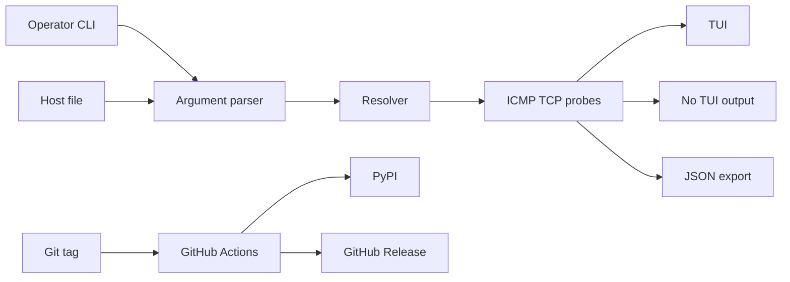

# pinghue Threat Model

## Executive summary

`pinghue` is a local Python CLI/TUI for concurrent ICMP and TCP host probing. Its highest-risk areas are local operator input rendered back to terminals/logs, network probing behavior against operator-supplied targets, Linux ICMP privilege guidance, JSON export paths, and release automation that can publish trusted artifacts to PyPI and GitHub Releases. The project does not expose an HTTP service, authentication layer, database, or multi-tenant data boundary.

## Scope and assumptions

In scope:

- Runtime package code under `src/pinghue`.
- CLI, TUI, no-TUI, doctor, DNS, ICMP/TCP probing, host file parsing, and JSON export behavior.
- Release and package integrity controls in `.github/workflows`, `pyproject.toml`, `MANIFEST.in`, and `packaging/homebrew/pinghue.rb`.

Out of scope:

- Generated caches, local virtual environments, build artifacts, tests as runtime surfaces, and example JSON as an executable surface.
- GitHub/PyPI/Homebrew organization settings that are not represented in the repository.

Assumptions:

- Intended deployment is local operator use, typically during maintenance windows.
- Attackers do not get remote code execution through a network listener because the tool opens none.
- Hostnames, host files, output paths, and CLI flags can be influenced by an operator and may sometimes come from semi-trusted operational notes.
- CI tag pushes are privileged release actions and should be protected by repository settings outside this tree.

Open questions:

- Whether the future GitHub repository will enforce protected tags and required approval for the `pypi` environment.
- Whether host files will ever be shared from untrusted sources such as customer tickets or public incident notes.

## System model

### Primary components

- CLI parser: `src/pinghue/cli.py` defines arguments for targets, host files, TCP ports, output paths, timing, concurrency, numeric DNS mode, and the doctor command.
- Host file parser: `src/pinghue/hostfile.py` reads one plain-text target per line and ignores blank/comment lines.
- Resolver and probes: `src/pinghue/probes.py` resolves DNS with `getaddrinfo`, performs TCP checks with `asyncio.open_connection`, and performs ICMP checks through `icmplib`.
- Runtime orchestrator: `src/pinghue/runner.py` resolves targets, schedules probes, prints no-TUI output, and writes JSON output.
- TUI renderer: `src/pinghue/app.py` and `src/pinghue/ui.py` render target data with Textual/Rich.
- JSON exporter: `src/pinghue/export.py` writes schema-versioned run reports.
- Doctor command: `src/pinghue/doctor.py` probes local ICMP socket capability and prints Linux/macOS remediation guidance.
- Release automation: `.github/workflows/ci.yml` and `.github/workflows/publish.yml` build, test, and publish artifacts.
- Repository hardening templates: `.github/repo-settings` and `scripts/apply-github-hardening.sh` document and apply branch, tag, and PyPI environment protections.

### Data flows and trust boundaries

- Operator shell -> CLI parser: target strings, flags, output paths, and timing options cross from operator-controlled input into runtime configuration. Validation exists for interval, timeout, port, count, duration, concurrency, fail threshold, address family, and history style.
- Host file -> host parser -> target list: a local file path selected by the operator is read as UTF-8 text and parsed line by line into target strings.
- Target list -> DNS resolver: hostnames cross from operator input into OS resolver APIs. `--numeric` bypasses DNS and requires IP literals.
- Resolved address -> ICMP/TCP probe: target addresses cross into local socket operations. ICMP mode depends on OS privilege configuration; TCP mode uses ordinary connect checks.
- Probe results -> TUI/no-TUI output: target strings, status, latency, and errors cross into terminal-rendered output.
- Probe results -> JSON output path: run metadata and per-target samples cross into a local file path selected by the operator.
- Git tag -> GitHub Actions -> PyPI/GitHub Release: a tag push crosses into release automation. The build job has read-only repository permissions; the publish job receives `id-token: write` and `contents: write` only after artifacts are produced.

#### Diagram

## Assets and security objectives

- Operator terminal integrity: target names and errors must not inject terminal control sequences or misleading log content.
- Operator workstation safety: the tool should avoid encouraging root execution and should make Linux ICMP privilege fixes explicit.
- Availability of monitoring view: malformed targets, failed DNS, denied sockets, and failed probes should degrade to clear statuses rather than crashing.
- JSON report integrity: exports should be valid against `schemas/output-v1.schema.json` and should not accidentally corrupt unrelated paths beyond the operator-selected output target.
- Release artifact integrity: PyPI sdists/wheels and GitHub release artifacts must be built from reviewed source with constrained CI permissions and reproducible tooling.

## Attacker model

Realistic capabilities:

- Provide or influence hostnames in a host file, CLI paste, or operational runbook.
- Cause DNS failures, connection refusals, timeouts, or OS/socket errors that are displayed to the operator.
- Attempt to abuse weak release automation through compromised action references or unintended tag publishing if repository controls are weak.

Non-capabilities:

- Direct remote requests to a long-running pinghue server, because no server exists.
- Bypass user account permissions for local file writes; output paths are selected by the local operator.
- Use pinghue as a setuid helper; the README and doctor guidance discourage root and setuid-style use.

## Threat enumeration

### T1: Terminal/log control injection through target or error text

An attacker who can influence a host list could include control characters that are later printed in no-TUI output or rendered in the TUI. This can mislead operators, hide lines, or corrupt copied logs. Existing controls now escape terminal control characters before operator-visible rendering.

Likelihood: medium when host files come from shared notes; low when targets are fully operator-authored.
Impact: low to medium. The likely impact is operator confusion and log integrity damage, not code execution.
Priority: medium before sanitization, low residual after sanitization.

### T2: Local misuse of privileged ICMP configuration

An operator might run the tool as root or grant capabilities too broadly to make ICMP work on Linux. The doctor command explicitly diagnoses ICMP readiness and recommends `ping_group_range` before `CAP_NET_RAW`; README guidance says not to set capabilities on a shared Python interpreter.

Likelihood: medium on Linux.
Impact: medium if capabilities are applied to an overly broad interpreter or wrapper.
Priority: medium, controlled mainly by documentation and doctor output.

### T3: Unbounded or unintended local file interactions

The host file path and output path are local operator inputs. A mistaken path can read a large file or overwrite an existing writable file. This is primarily a local footgun because the same user selects the paths.

Likelihood: medium.
Impact: low in normal use; medium only if the tool is run with elevated privileges contrary to guidance.
Priority: low, with a conditional medium if future packaging turns pinghue into any privileged helper.

### T4: Release workflow supply-chain compromise

Publishing workflows have high-value permissions: `id-token: write` for PyPI trusted publishing and `contents: write` for GitHub releases. Mutable or compromised third-party action refs or unpinned build tooling can affect published artifacts.

Likelihood: low to medium depending on repository/tag protections.
Impact: high because a compromised publish job could ship malicious packages.
Priority: high for hardening, even if exploitability depends on upstream action compromise or repository control failure.

## Existing mitigations

- CLI input ranges are validated for timing, count, concurrency, fail threshold, and port.
- `--numeric` enforces IP literals through `ipaddress`.
- Probe execution is concurrency-limited with `asyncio.Semaphore`.
- Linux ICMP readiness is diagnosed by actually opening a DGRAM ICMP socket rather than inferring from UID.
- JSON output is schema-versioned and validated by tests.
- CI uses least-privilege `contents: read` in normal test workflow.
- Publish workflow uses PyPI trusted publishing rather than static PyPI tokens.
- Publish workflow separates build from release publication so OIDC and release-write permissions are scoped to the final publish job.
- Repository hardening assets define required PRs, signed commits, protected release tags, and a protected `pypi` environment.

## Recommended mitigations and focus paths

- Keep display sanitization tests in place for no-TUI and TUI paths.
- Keep GitHub Actions pinned to full commit SHAs, with Dependabot tracking actions and Python dependencies.
- Apply `scripts/apply-github-hardening.sh inxbit/pinghue` after the first push, then verify branch rulesets, tag rulesets, and the `pypi` environment in GitHub settings.
- Keep publish build tooling pinned and use `python -m build --no-isolation` in release jobs.
- Consider future limits for host file size, target count, and per-target display length if untrusted host lists become common.

Focus paths:

- `src/pinghue/cli.py`: primary operator input validation.
- `src/pinghue/hostfile.py`: host file parsing boundary.
- `src/pinghue/probes.py`: DNS, ICMP, and TCP socket boundary.
- `src/pinghue/runner.py`: no-TUI output and JSON export orchestration.
- `src/pinghue/ui.py`: terminal rendering boundary.
- `src/pinghue/doctor.py`: privilege guidance and environment diagnostics.
- `.github/workflows/publish.yml`: trusted publishing and release artifact boundary.
- `pyproject.toml`: dependency and build backend boundary.

## Quality check

- Entry points covered: CLI args, host file, DNS resolution, ICMP/TCP sockets, no-TUI/TUI output, JSON export, doctor command, CI publish workflow.
- Trust boundaries covered: operator input to parser, file to parser, target to DNS/socket APIs, probe result to terminal output, probe result to JSON file, tag to release automation.
- Runtime vs CI/dev separated: runtime code and release workflows are modeled separately; tests/examples/caches are out of runtime scope.
- User clarifications: no correction received to the local CLI/no-service assumption during review.
- Open assumptions: repository settings for protected tags and PyPI environment approval remain outside the local tree.
