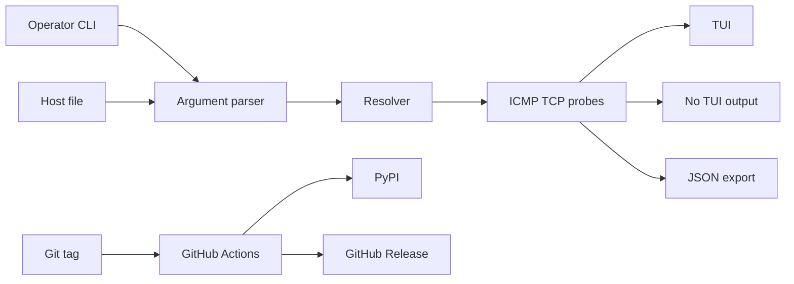

# pinghue Threat Model

## Executive summary

`pinghue` is a local Python CLI/TUI for concurrent ICMP and TCP host probing. The main risk themes are integrity of terminal/JSON evidence produced from operator-supplied target text, safe handling of operator-selected local files, Linux ICMP privilege guidance, and release integrity for PyPI/GitHub artifacts. The runtime does not expose a server, remote API, authentication layer, database, or multi-tenant boundary.

## Scope and assumptions

In scope:

- Runtime package code under `src/pinghue`.
- CLI, TUI, no-TUI, doctor, DNS, ICMP/TCP probing, host-file parsing, and JSON export behavior.
- Release and package integrity controls in `.github/workflows`, `.github/repo-settings`, `pyproject.toml`, `MANIFEST.in`, and `packaging/homebrew/pinghue.rb`.
- Security process documentation in `SECURITY.md`, `docs/repository-hardening.md`, and `docs/release-checklist.md`.

Out of scope:

- Generated caches, local virtual environments, `dist/`, tests as deployed runtime surfaces, and examples as executable surfaces.
- GitHub/PyPI/Homebrew organization settings that are not represented in the repository.
- Network policy decisions about which operator-selected targets are appropriate to probe.

Assumptions:

- Intended deployment is local operator use, typically during maintenance windows.
- Targets, host files, output paths, and CLI flags are operator-controlled, but host lists may be copied from semi-trusted operational notes.
- Attackers cannot send requests to a long-running `pinghue` service because the project opens no listener.
- Release tags and the `pypi` environment are protected in the hosted repository using the checked-in ruleset templates; live state was verified on 2026-05-19.

Open questions:

- Whether future host files will be accepted from untrusted customer tickets, public incident notes, or generated inventories.
- Whether any future package will run `pinghue` with elevated privileges rather than as the invoking user.

## System model

### Primary components

- CLI parser: `src/pinghue/cli.py` defines targets, host files, TCP ports, output paths, timing, concurrency, numeric DNS mode, `--host-label`, `--resolve-name`, `--fail-on-down`, and the doctor command.
- Host-file parser: `src/pinghue/hostfile.py` reads one target per line, ignores blank/comment lines, rejects non-regular files, caps files at 1 MiB, and caps parsed line count at 5,000.
- Resolver and probes: `src/pinghue/probes.py` resolves names with `getaddrinfo`, performs TCP checks with `asyncio.open_connection`, and performs ICMP checks through `icmplib`.
- Runtime orchestrator: `src/pinghue/runner.py` resolves targets in parallel, schedules bounded probes, prints no-TUI output, handles no-TUI interrupts, and writes JSON output.
- TUI renderer: `src/pinghue/app.py` owns Textual task lifecycle; `src/pinghue/ui.py` formats and sanitizes table cells.
- JSON exporter: `src/pinghue/export.py` writes schema-versioned run reports through a temporary file and replace.
- Doctor command: `src/pinghue/doctor.py` probes local ICMP socket capability and prints Linux/macOS remediation guidance.
- Release automation: `.github/workflows/ci.yml`, `.github/workflows/publish.yml`, and `.github/workflows/dependency-audit.yml` build, test, audit, attest, and publish artifacts.
- Repository hardening templates: `.github/repo-settings` and `scripts/apply-github-hardening.sh` document branch, tag, and PyPI environment protections.

### Data flows and trust boundaries

- Operator shell -> CLI parser: target strings, flags, output paths, and timing options cross from operator-controlled input into runtime configuration. Validation covers interval, timeout, port, count, duration, concurrency, fail threshold, address family, numeric literals, and history style.
- Host file -> host parser -> target list: a local operator-selected path is read as UTF-8 text. The parser requires a regular file, checks byte size before reading, and aborts when the parsed line count exceeds the configured cap.
- Target list -> DNS resolver: hostnames cross from operator input into OS resolver APIs. `--numeric` bypasses DNS and requires IP literals.
- Resolved address -> ICMP/TCP probe: target addresses cross into local socket operations. ICMP mode depends on OS privilege configuration; TCP mode uses ordinary connect checks.
- Probe results -> TUI/no-TUI output: target strings, status, latency, and OS/library error text cross into terminal-rendered output after display sanitization.
- Probe results -> JSON output path: run metadata and per-target samples cross into a local file path selected by the operator. Target, error, and host-label strings are sanitized before export, and output is written through temp-file replace.
- Git tag -> GitHub Actions -> PyPI/GitHub Release: a tag push crosses into release automation. Build jobs use read-only repository permissions; publish permissions are scoped to the final publish job with OIDC and release write permissions.

#### Diagram

## Assets and security objectives

| Asset | Why it matters | Security objective |
| --- | --- | --- |
| Operator terminal integrity | Target names and errors should not inject terminal controls or misleading output. | Integrity |
| JSON evidence reports | Reports may be used as maintenance evidence and should remain valid, safe to render, and complete after interruption. | Integrity, availability |
| Operator workstation permissions | ICMP should work without encouraging root execution or unsafe capability placement. | Integrity, least privilege |
| Monitoring availability | Malformed targets, resolver errors, and denied sockets should degrade to clear statuses rather than crashing. | Availability |
| Release artifacts | PyPI wheels/sdists and GitHub releases are trusted by downstream installers. | Integrity |
| Repository release controls | Branch/tag/environment settings protect the path from source to published artifact. | Integrity |

## Attacker model

### Capabilities

- Provide or influence hostnames in a host file, CLI paste, or operational runbook.
- Cause DNS failures, connection refusals, timeouts, or OS/socket errors that are displayed to the operator.
- Attempt to exploit weak release automation through compromised action references, unsafe tag publication, or missing environment approval.
- Influence an operator to choose unsafe local paths or broad Linux ICMP settings.

### Non-capabilities

- Send remote requests to a `pinghue` service; no server exists.
- Bypass the invoking user's OS permissions for local file reads or writes.
- Execute arbitrary local commands through runtime inputs; the runtime does not use shell execution, dynamic evaluation, unsafe deserialization, or subprocess calls.
- Rely on `pinghue` being setuid or privileged; documentation and doctor guidance assume ordinary user execution.

## Entry points and attack surfaces

| Surface | How reached | Trust boundary | Notes | Evidence |
| --- | --- | --- | --- | --- |
| CLI arguments | Local operator command line | Operator input -> parser | Numeric, timing, port, duration, count, concurrency, and fail threshold values are validated. | `src/pinghue/cli.py:44`, `src/pinghue/cli.py:151` |
| Host file | `-f/--file` | Local file -> parser | Requires regular file, 1 MiB maximum, 5,000-line maximum. | `src/pinghue/hostfile.py:9` |
| DNS resolver | Hostnames in target list | Target text -> OS resolver | `--numeric` can avoid DNS and requires IP literals. | `src/pinghue/probes.py:53`, `src/pinghue/cli.py:134` |
| TCP probe | `-p/--port` | Resolved address -> socket connect | Uses `asyncio.open_connection` with timeout and errno classification. | `src/pinghue/probes.py:103` |
| ICMP probe | default mode | Resolved address -> `icmplib` | Uses unprivileged ICMP where available. | `src/pinghue/probes.py:144` |
| No-TUI output | `--no-tui` | Probe result -> terminal | Target and error text are sanitized before printing. | `src/pinghue/runner.py:184` |
| TUI output | default mode | Probe result -> Textual/Rich | Target and address cells are sanitized before rendering. | `src/pinghue/ui.py:217` |
| JSON export | `--output PATH` | Probe result -> local file | Target/error/host fields are sanitized and written through a randomized `NamedTemporaryFile` (O_EXCL, mode 0600) before atomic replace. | `src/pinghue/export.py:25`, `src/pinghue/export.py:92` |
| Doctor DNS probe | `--check --resolve-name` | Operator diagnostic host -> OS resolver | Used only for local diagnostics. | `src/pinghue/doctor.py:97`, `src/pinghue/cli.py:199` |
| Publish workflow | Signed release tag | Git tag -> PyPI/GitHub Release | Uses pinned actions, OIDC, attestations, concurrency, and split permissions. | `.github/workflows/publish.yml:11`, `.github/workflows/publish.yml:38` |
| Dependency audit workflow | Weekly schedule, PR, manual | Dependency metadata -> advisory lookup | Read-only workflow runs `pip-audit`. | `.github/workflows/dependency-audit.yml:1` |

## Top abuse paths

1. Terminal evidence manipulation:
   - Attacker influences a copied host list with control characters.
   - Operator runs no-TUI or TUI mode and captures output.
   - Without sanitization, rendered output could hide lines or mislead responders.
   - Current control: `sanitize_display` escapes C0/C1 control characters before display and JSON export.

2. JSON report poisoning:
   - Attacker controls target or error text through DNS/socket behavior or a shared host list.
   - Operator writes a JSON report and later renders it in a terminal or chat tool.
   - Current control: exported target/error/host fields are sanitized before serialization.

3. Host-file resource exhaustion:
   - Operator accidentally points `--file` at a device, large log, or generated inventory.
   - Parser could block or consume memory if unrestricted.
   - Current control: parser rejects non-regular files, files over 1 MiB, and more than 5,000 parsed lines.

4. Report truncation or misdirection during write:
   - Operator interrupts a maintenance-window run while JSON evidence is being written, or a same-user actor pre-places a symlink at a predictable temp path.
   - A partial file could masquerade as final evidence, or a symlinked write could clobber an unrelated file.
   - Current control: no-TUI signal handling records interruption; JSON output is written through a randomized `NamedTemporaryFile` (O_EXCL, mode 0600) in the destination directory, then atomically replaced.

5. Unsafe Linux ICMP remediation:
   - Operator needs ICMP and applies a broad or misplaced privilege fix.
   - Overbroad `ping_group_range` or `CAP_NET_RAW` placement can widen local ICMP privileges.
   - Current control: doctor and Homebrew caveats recommend a group-specific range and warn when the broad range is chosen.

6. Release workflow compromise:
   - A release tag triggers publishing with OIDC and release permissions.
   - Mutable actions or weak repository settings could publish tampered artifacts.
   - Current control: actions are pinned to SHAs, publish permissions are isolated, artifacts are attested, and ruleset templates require signed protected release refs.

7. Dependency advisory drift:
   - A runtime or dev dependency later receives a vulnerability advisory.
   - Maintainers may miss the advisory before publishing a new release.
   - Current control: Dependabot and weekly `pip-audit` workflow cover dependency update and advisory visibility.

## Threat model table

| Threat ID | Threat source | Prerequisites | Threat action | Impact | Impacted assets | Existing controls | Gaps | Recommended mitigations | Detection ideas | Likelihood | Impact severity | Priority |
| --- | --- | --- | --- | --- | --- | --- | --- | --- | --- | --- | --- | --- |
| TM-001 | Semi-trusted host list provider | Operator copies target names from shared notes or generated inventory. | Inject terminal control characters into target names or error strings that later render in terminal output or reports. | Misleading operator evidence or hidden output lines. | Operator terminal integrity, JSON evidence reports | `sanitize_display` escapes C0/C1 controls (`src/pinghue/display.py:6`); no-TUI, TUI, and export call it (`src/pinghue/runner.py:184`, `src/pinghue/ui.py:217`, `src/pinghue/export.py:25`). | Residual risk from non-control Unicode confusables remains a documentation concern, not terminal control execution. | Keep display/export tests and treat any new output path as a required sanitizer caller. | Tests containing ESC/CSI payloads; manual review of new Rich/Textual output paths. | Low | Medium | Low |
| TM-002 | Local operator mistake or malicious local guidance | Operator selects an unintended `--file` path. | Read a non-host file, huge file, or special file as host input. | Local denial of service or accidental disclosure through displayed target names. | Monitoring availability, operator workstation permissions | Regular-file, 1 MiB, and 5,000-line limits (`src/pinghue/hostfile.py:9`). | Time-of-check/time-of-use races are possible but only across local user-selected paths and no privilege boundary. | Keep `pinghue` unprivileged; if packaging ever adds privileges, rework file handling to open and validate descriptors atomically. | Host-file rejection tests and CLI error telemetry if added later. | Low | Low | Low |
| TM-003 | Local operator mistake or interrupted process | Operator selects an output path or interrupts during report writing. | Overwrite a chosen local path, leave partial JSON evidence, or have a pre-placed temp symlink redirect the write. | Incomplete, misleading, or misdirected maintenance evidence. | JSON evidence reports | Randomized `NamedTemporaryFile` with O_EXCL and mode 0600 in the same directory, followed by atomic replace and cleanup (`src/pinghue/export.py:92`); no-TUI interruption path records `exit_reason="interrupted"` (`src/pinghue/runner.py:210`). | Output path overwrite remains operator-controlled behavior. | Keep clear documentation that `--output` overwrites the selected path; avoid adding privileged execution. | JSON schema validation in tests; operational check for `exit_reason`. | Low | Medium | Low |
| TM-004 | Network-side host behavior | Operator probes a hostname whose DNS or replicas fail unevenly. | Cause DNS failures, socket errors, refusals, or timeouts that affect reported status. | Incorrect status or noisy maintenance report. | Monitoring availability, JSON evidence reports | Resolver stores all addresses and probe execution can fail over within a round (`src/pinghue/probes.py:93`, `src/pinghue/runner.py:88`); errno constants classify unreachable states (`src/pinghue/probes.py:15`). | Anycast/round-robin health can still be context-dependent. | Keep address failover tests and consider exposing selected address history if operators need audit detail. | Probe sample status distribution and JSON address fields. | Medium | Low | Low |
| TM-005 | Local Linux operator | ICMP is unavailable to an unprivileged user. | Run as root or apply overly broad ICMP permissions. | Wider local privilege surface than needed. | Operator workstation permissions | Doctor uses real DGRAM socket check (`src/pinghue/doctor.py:60`); recommended Linux fix is current GID range (`src/pinghue/doctor.py:152`, `packaging/homebrew/pinghue.rb:79`). | Hosted docs cannot enforce operator choices. | Keep group-specific guidance first; avoid setuid packaging; document CAP_NET_RAW reapplication risks. | `pinghue --check` output and package caveat review. | Medium | Medium | Medium |
| TM-006 | Supply-chain attacker | Release tag workflow can publish artifacts. | Abuse mutable workflow dependencies, weak tag controls, or overbroad credentials to ship malicious packages. | Compromised PyPI/GitHub release artifacts. | Release artifacts, repository release controls | Pinned action SHAs, non-persisted checkout credentials, split publish job, OIDC, attestations, concurrency (`.github/workflows/publish.yml:11`, `.github/workflows/publish.yml:38`); branch/tag ruleset templates require review/signatures/protected tags (`.github/repo-settings/main-ruleset.json:11`, `.github/repo-settings/release-tag-ruleset.json:11`); live repository rulesets and the `pypi` environment were verified on 2026-05-19. | Hosted settings can drift after repository migration or manual settings changes. | Re-verify GitHub rulesets and `pypi` environment after each repository migration; keep Dependabot action updates reviewed. | GitHub ruleset audit, release attestation verification, protected-environment approval logs. | Low | High | Medium |
| TM-007 | Dependency ecosystem attacker | A dependency later receives an advisory or malicious update. | Exploit a vulnerable package in runtime or release tooling. | Runtime compromise depends on affected dependency surface; release tooling compromise can affect artifacts. | Release artifacts, monitoring availability | Runtime dependency ranges are narrow (`pyproject.toml:30`); Dependabot and weekly `pip-audit` workflow exist (`.github/dependabot.yml:1`, `.github/workflows/dependency-audit.yml:1`). | `pip-audit` result quality depends on current advisory database access. | Keep audit workflow required or visible before release; review dependency changes before publishing. | Dependabot alerts, `pip-audit`, release checklist gates. | Low | Medium | Low |

## Criticality calibration

- Critical: a path that lets remote attackers execute code, publish malicious release artifacts without review, or steal credentials. Examples would include a compromised publish job with active PyPI permissions, a malicious release tag accepted without protection, or future privileged runtime code reachable from untrusted files.
- High: a release-integrity weakness that can plausibly alter artifacts, or a future server/API path that lets unauthenticated users choose probe destinations. Examples would include mutable release actions with publish permissions, static PyPI tokens in the repo, or an internet-facing wrapper around the probe API.
- Medium: issues that can mislead operators, widen local privileges, or degrade evidence integrity under realistic operating conditions. Examples include terminal control injection, overbroad ICMP privilege guidance, and partial JSON evidence on interruption.
- Low: local footguns or issues requiring the invoking user's own permissions with limited security impact. Examples include accidental output overwrite, probing the wrong operator-selected target, or unsupported DNS behavior in isolated networks.

## Focus paths for security review

| Path | Why it matters | Related Threat IDs |
| --- | --- | --- |
| `src/pinghue/cli.py` | Primary operator input validation and mode selection. | TM-001, TM-002, TM-004 |
| `src/pinghue/hostfile.py` | Host-file read boundary and resource controls. | TM-002 |
| `src/pinghue/probes.py` | DNS, ICMP, TCP socket, timeout, failover, and error-classification boundary. | TM-004 |
| `src/pinghue/runner.py` | No-TUI output, probe scheduling, signal handling, and JSON export orchestration. | TM-001, TM-003, TM-004 |
| `src/pinghue/ui.py` | TUI rendering boundary for target and address text. | TM-001 |
| `src/pinghue/export.py` | JSON evidence schema, sanitization, and atomic write behavior. | TM-001, TM-003 |
| `src/pinghue/doctor.py` | ICMP privilege diagnostics and remediation guidance. | TM-005 |
| `.github/workflows/publish.yml` | Trusted publishing, artifact attestation, and release permissions. | TM-006 |
| `.github/repo-settings/` | Branch, tag, and PyPI environment protection templates. | TM-006 |
| `pyproject.toml` | Dependency ranges, build backend, and package entrypoint. | TM-007 |
| `packaging/homebrew/pinghue.rb` | Homebrew dependency pinning, smoke test, and Linux privilege caveats. | TM-005, TM-007 |

## Quality check

- Entry points covered: CLI args, host file, DNS resolution, ICMP/TCP sockets, no-TUI/TUI output, JSON export, doctor command, dependency audit, and publish workflow.
- Trust boundaries covered: operator input to parser, file to parser, target to DNS/socket APIs, probe result to terminal output, probe result to JSON file, tag to release automation, and dependency metadata to advisory audit.
- Runtime vs CI/dev separated: runtime code and release workflows are modeled separately; tests/examples/caches/build artifacts are out of runtime scope.
- User clarifications: no correction received to the local CLI/no-service assumption; report keeps that assumption explicit.
- Open assumptions: future host-file trust level and any future privileged wrapper remain unknown; hosted repository ruleset and PyPI environment state were verified on 2026-05-19 and should be re-verified after migrations or manual settings changes.
